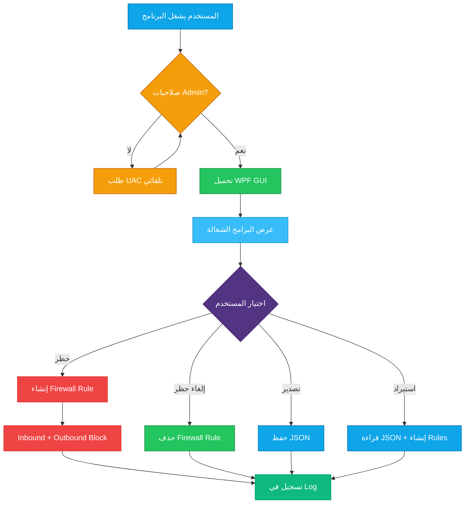

<div align="center">


[](#)
[](#-المتطلبات)
[](#-المتطلبات)
[](#-المميزات)
[](https://github.com/F2lcon01)

<br>

### التشغيل السريع

```powershell
powershell -ExecutionPolicy Bypass -File "AppNetworkController.ps1"
```

او دبل كلك على `AppNetworkController.bat`

<br>

</div>

---

## الفهرس

| # | القسم | الوصف |
|:-:|-------|-------|
| 1 | [نظرة عامة](#-نظرة-عامة) | ايش يسوي البرنامج ولمن |
| 2 | [المميزات](#-المميزات) | كل الخصائص بالتفصيل |
| 3 | [طريقة التشغيل](#-طريقة-التشغيل) | خطوات التثبيت والتشغيل |
| 4 | [شرح الواجهة](#-شرح-الواجهة) | شرح كل قسم في البرنامج |
| 5 | [البنية التقنية](#-البنية-التقنية) | كيف يشتغل البرنامج من الداخل |
| 6 | [المتطلبات](#-المتطلبات) | ايش تحتاج عشان يشتغل |
| 7 | [الملفات](#-الملفات) | شرح كل ملف في المشروع |

---

<div align="center">

## نظرة عامة

</div>

> **App Network Controller** برنامج يتحكم بوصول البرامج للإنترنت عن طريق قواعد Windows Firewall.
> بضغطة زر تقدر تحظر أي برنامج من الاتصال بالإنترنت — أو تلغي الحظر.

```
  ┌─────────────────────────────────────────────────────────────────┐
  │                                                                 │
  │   🛡️  App Network Controller v2.0                              │
  │                                                                 │
  │   ✅  حظر البرامج من الإنترنت بنقرة واحدة                      │
  │   ✅  واجهة رسومية حديثة (Dark Theme)                           │
  │   ✅  كشف البرامج المثبتة تلقائياً من Registry                  │
  │   ✅  تصدير واستيراد قواعد الحظر (JSON)                         │
  │   ✅  سجل عمليات كامل (Log)                                     │
  │   ✅  يطلب صلاحيات المسؤول تلقائياً                             │
  │                                                                 │
  └─────────────────────────────────────────────────────────────────┘
```

> [!TIP]
> البرنامج مفيد جداً لحظر البرامج بعد تثبيتها — مثل منع التطبيقات من إرسال بيانات أو التحديث التلقائي.

---

<div align="center">

## المميزات

</div>

---

<div align="center">

### 1️⃣ حظر البرامج الشغالة — Running Apps

</div>

> عرض جميع البرامج الشغالة حالياً مع حالة كل برنامج (محظور / مسموح):

```
  ┌──────────────────────────────────────────────────────────────┐
  │  📋 Running Apps                                             │
  │                                                              │
  │  Name              Path                        Status        │
  │  ─────────────     ───────────────────────     ──────        │
  │  chrome            C:\Program Files\Google..   🟢 Allowed    │
  │  discord           C:\Users\...\Discord..      🔴 Blocked    │
  │  spotify           C:\Users\...\Spotify..      🟢 Allowed    │
  │                                                              │
  │  🔄 Refresh    🔍 Search: [_______________]                  │
  │                                                              │
  │  📌 دبل كلك على أي برنامج = حظر / إلغاء حظر                │
  │  📌 كلك يمين = قائمة الخيارات                                │
  └──────────────────────────────────────────────────────────────┘
```

> [!NOTE]
> البرامج النظامية (مثل `svchost`, `explorer`, `lsass`) محمية ولا يمكن حظرها.

---

<div align="center">

### 2️⃣ كشف البرامج المثبتة — Installed Apps

</div>

> يفحص الـ Registry ويعرض كل البرامج المثبتة على الجهاز — حتى لو مو شغالة حالياً:

```
  📡  مصادر الكشف:
      ├── HKLM\SOFTWARE\...\Uninstall         → البرامج 64-bit
      ├── HKLM\SOFTWARE\WOW6432Node\...\      → البرامج 32-bit
      └── HKCU\SOFTWARE\...\Uninstall         → برامج المستخدم الحالي
```

> [!TIP]
> اضغط **Scan** لفحص البرامج المثبتة. الفحص يأخذ لحظات لأنه يمر على كل الـ Registry.

---

<div align="center">

### 3️⃣ إدارة البرامج المحظورة — Blocked Apps

</div>

> عرض جميع قواعد الحظر الموجودة مع إمكانية:

```
  ┌──────────────────────────────────────────────────────────────┐
  │  🚫 Blocked Apps                                             │
  │                                                              │
  │  🔄 Refresh   ✅ Unblock All   📤 Export   📥 Import        │
  │                                                              │
  │  Name         Path                  Direction    Rule        │
  │  ─────        ────                  ─────────    ────        │
  │  discord      C:\...\discord.exe    Outbound     AppBlocker_ │
  │  discord      C:\...\discord.exe    Inbound      AppBlocker_ │
  │                                                              │
  │  📌 دبل كلك = إلغاء حظر مع تأكيد                           │
  └──────────────────────────────────────────────────────────────┘
```

> [!IMPORTANT]
> - **Export** — يحفظ كل القواعد في ملف JSON (للنقل لجهاز ثاني)
> - **Import** — يستورد قواعد من ملف JSON ويطبقها
> - **Unblock All** — يزيل كل قواعد الحظر دفعة واحدة (مع تأكيد)

---

<div align="center">

### 4️⃣ حظر بالمسار — Block by Path

</div>

> حظر أي ملف `.exe` مباشرة عن طريق المسار أو زر Browse:

```
  ┌──────────────────────────────────────────────────────────────┐
  │  📂 Block by Path                                            │
  │                                                              │
  │  المسار: [C:\Program Files\App\app.exe    ] [Browse...]      │
  │                                                              │
  │  الاسم المكتشف: app                                          │
  │                                                              │
  │  [🚫 Block This Application]                                 │
  │                                                              │
  │  ─── Recent Blocks ───                                       │
  │  app1    C:\...\app1.exe                                     │
  │  app2    C:\...\app2.exe                                     │
  └──────────────────────────────────────────────────────────────┘
```

> [!TIP]
> مفيد لحظر برامج مو شغالة حالياً وما تظهر في Running Apps — اختر الملف مباشرة.

---

<div align="center">

### 5️⃣ سجل العمليات — Logs

</div>

> كل عملية حظر أو إلغاء حظر تُسجّل مع الوقت والتاريخ:

```
  [2026-04-08 05:51:02] === App Network Controller v2.0 started ===
  [2026-04-08 05:51:15] BLOCKED | chrome | C:\...\chrome.exe
  [2026-04-08 05:52:03] UNBLOCKED | chrome | 2 rules
  [2026-04-08 05:53:00] EXPORTED | 4 rules to backup.json
```

---

<div align="center">

### 6️⃣ الإعدادات — Settings

</div>

> - تصدير واستيراد القواعد
> - عرض قائمة العمليات النظامية المحمية
> - معلومات عن البرنامج

---

<div align="center">

## طريقة التشغيل

</div>

---

<div align="center">

### الطريقة 1 — دبل كلك (الأسهل)

</div>

```
  🟡 الخطوة 1 ──→  دبل كلك على AppNetworkController.bat
  
  🟡 الخطوة 2 ──→  تظهر نافذة UAC — اضغط Yes (نعم)
  
  🟢 النتيجة  ──→  البرنامج يفتح بواجهة رسومية مباشرة
```

---

<div align="center">

### الطريقة 2 — من Terminal

</div>

```powershell
powershell -ExecutionPolicy Bypass -File "AppNetworkController.ps1"
```

> [!WARNING]
> البرنامج يحتاج **صلاحيات المسؤول (Administrator)** — إذا شغلته بدون صلاحيات، يطلبها تلقائياً عبر نافذة UAC.

---

<div align="center">

## شرح الواجهة

</div>

> الواجهة مقسمة لعدة أجزاء رئيسية:

```
  ┌──────────────────────────────────────────────────────────────┐
  │  🛡️ App Network Controller v2.0                    🟢 Ready │
  ├───────────────┬──────────────────────────────────────────────┤
  │               │                                              │
  │  📋 Running   │     [ محتوى القسم المختار ]                  │
  │  💿 Installed │                                              │
  │  🚫 Blocked   │     DataGrid مع البيانات                     │
  │  📂 By Path   │     + أزرار التحكم                           │
  │  📊 Logs      │     + خانة البحث                             │
  │  ⚙️ Settings  │                                              │
  │               │                                              │
  ├───────────────┴──────────────────────────────────────────────┤
  │  Ready                                            05:51:02   │
  └──────────────────────────────────────────────────────────────┘
```

| القسم | الوظيفة | طريقة الاستخدام |
|-------|---------|----------------|
| **📋 Running Apps** | البرامج الشغالة حالياً | دبل كلك لحظر/إلغاء حظر |
| **💿 Installed Apps** | كل البرامج المثبتة | اضغط Scan ثم دبل كلك |
| **🚫 Blocked Apps** | القواعد المحظورة | دبل كلك لإلغاء حظر + Export/Import |
| **📂 Block by Path** | حظر بمسار الملف | Browse واختر الملف ثم Block |
| **📊 Logs** | سجل العمليات | Refresh لتحديث + Clear لمسح |
| **⚙️ Settings** | إعدادات وتصدير | Export/Import + عرض Whitelist |

> [!TIP]
> **البحث**: كل تبويب فيه خانة بحث — اكتب اسم البرنامج وتتصفى القائمة فوراً.

---

<div align="center">

## البنية التقنية

</div>



> [!NOTE]
> كل عملية حظر تنشئ **قاعدتين** في Windows Firewall — واحدة Inbound وواحدة Outbound — لضمان حظر كامل.

---

<div align="center">

## المتطلبات

</div>

| المتطلب | التفاصيل |
|---------|----------|
|  | Windows 10 أو Windows 11 |
|  | مثبت مسبقاً مع Windows |
|  | صلاحيات المسؤول (يطلبها تلقائياً) |
|  | مثبت مسبقاً مع Windows |

> [!IMPORTANT]
> لا يحتاج تثبيت أي شيء إضافي — كل المتطلبات موجودة مع Windows.

---

<div align="center">

## الملفات

</div>

| الملف | الوظيفة | طريقة التشغيل |
|-------|---------|--------------|
| `AppNetworkController.ps1` | البرنامج الرئيسي — واجهة رسومية كاملة | `powershell -ExecutionPolicy Bypass -File "AppNetworkController.ps1"` |
| `AppNetworkController.bat` | ملف تشغيل سريع — دبل كلك | **دبل كلك** على الملف مباشرة |

```
  📁 Block-apps-internet/
      ├── AppNetworkController.ps1    ← البرنامج الرئيسي (واجهة + محرك)
      ├── AppNetworkController.bat    ← لانشر للتشغيل السريع
      └── README.md                   ← هذا الملف
```

> [!CAUTION]
> لا تحذف ملف `.ps1` — ملف `.bat` يعتمد عليه للتشغيل.

---

<div align="center">

### كيف يحظر البرنامج؟

</div>

```
  🔴 الحظر:
      New-NetFirewallRule → AppBlocker_AppName_OUT (Outbound Block)
      New-NetFirewallRule → AppBlocker_AppName_IN  (Inbound Block)

  🟢 إلغاء الحظر:
      Remove-NetFirewallRule → AppBlocker_AppName_OUT
      Remove-NetFirewallRule → AppBlocker_AppName_IN
```

> جميع القواعد تبدأ بالبادئة `AppBlocker_` — سهلة التعرف عليها في Windows Firewall.

---

<div align="center">

**App Network Controller v2.0** — بقلم Falcon (fox01vip@gmail.com)

[](https://github.com/F2lcon01)


</div>
