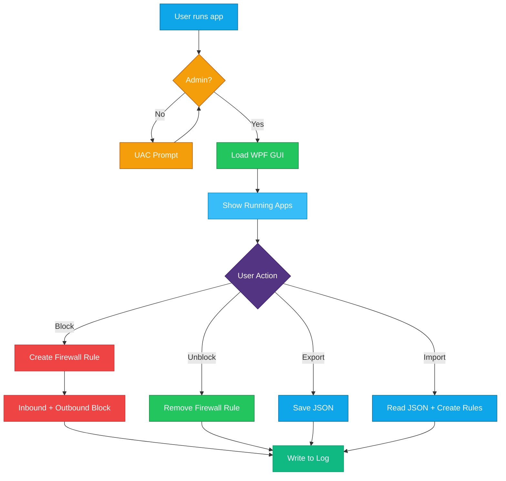

<div align="center">


[](https://github.com/F2lcon01/Block-apps-internet)
[](https://github.com/F2lcon01/Block-apps-internet)
[](https://github.com/F2lcon01/Block-apps-internet)
[](https://github.com/F2lcon01/Block-apps-internet)
[](https://github.com/F2lcon01)

</div>

---

<div align="center">

### التشغيل السريع

</div>

```powershell
powershell -ExecutionPolicy Bypass -File "AppNetworkController.ps1"
```

> او **دبل كلك** على ملف `AppNetworkController.bat`

---

## الفهرس

| # | القسم | الوصف |
|:-:|-------|-------|
| 1 | [نظرة عامة](#نظرة-عامة) | ايش يسوي البرنامج ولمن |
| 2 | [المميزات](#المميزات) | كل الخصائص بالتفصيل |
| 3 | [طريقة التشغيل](#طريقة-التشغيل) | خطوات التثبيت والتشغيل |
| 4 | [شرح الواجهة](#شرح-الواجهة) | شرح كل قسم في البرنامج |
| 5 | [البنية التقنية](#البنية-التقنية) | كيف يشتغل البرنامج من الداخل |
| 6 | [المتطلبات](#المتطلبات) | ايش تحتاج عشان يشتغل |
| 7 | [الملفات](#الملفات) | شرح كل ملف في المشروع |

---

## نظرة عامة

**App Network Controller** برنامج يتحكم بوصول البرامج للانترنت عن طريق قواعد Windows Firewall.
بضغطة زر تقدر تحظر اي برنامج من الاتصال بالانترنت - او تلغي الحظر.

```
  +---------------------------------------------------------------+
  |                                                                 |
  |   App Network Controller v2.5                                   |
  |                                                                 |
  |   [+] حظر البرامج من الانترنت بنقرة واحدة                      |
  |   [+] واجهة رسومية حديثة (Dark Theme)                           |
  |   [+] كشف البرامج المثبتة تلقائيا من Registry                   |
  |   [+] تصدير واستيراد قواعد الحظر (JSON)                         |
  |   [+] سجل عمليات كامل (Log)                                     |
  |   [+] يطلب صلاحيات المسؤول تلقائيا                              |
  |                                                                 |
  +---------------------------------------------------------------+
```

> [!TIP]
> البرنامج مفيد جدا لحظر البرامج بعد تثبيتها - مثل منع التطبيقات من ارسال بيانات او التحديث التلقائي.

---

## الجديد في v2.5

| التحسين | التفاصيل |
|---------|----------|
| **اداء اسرع 5x** | استبدال Get-NetFirewallRule بـ COM API (HNetCfg.FwPolicy2) |
| **ذاكرة اقل** | VirtualizingStackPanel + ArrayList بدل array concatenation |
| **حظر جماعي** | زر "Block All Non-System" لحظر كل البرامج دفعة واحدة |
| **توافق افضل** | حذف Emoji واستبدالها بنص عادي - يعمل على كل الانظمة |
| **بدء اسرع** | حذف P/Invoke غير ضروري + تنظيف XAML |
| **كود انظف** | حذف Styles غير مستخدمة + تحسين هيكل الكود |

---

## المميزات

---

### 1 - حظر البرامج الشغالة (Running Apps)

عرض جميع البرامج الشغالة حاليا مع حالة كل برنامج (محظور / مسموح):

- **دبل كلك** على اي برنامج = حظر او الغاء حظر
- **كلك يمين** = قائمة الخيارات
- **خانة البحث** = فلترة فورية بالاسم او المسار
- **Refresh** = تحديث القائمة
- **Block All Non-System** = حظر كل البرامج غير النظامية دفعة واحدة

> [!NOTE]
> البرامج النظامية مثل `svchost` و `explorer` و `lsass` محمية ولا يمكن حظرها.

---

### 2 - كشف البرامج المثبتة (Installed Apps)

يفحص الـ Registry ويعرض كل البرامج المثبتة على الجهاز - حتى لو مو شغالة حاليا.

**مصادر الكشف:**
- `HKLM\SOFTWARE\...\Uninstall` - البرامج 64-bit
- `HKLM\SOFTWARE\WOW6432Node\...\Uninstall` - البرامج 32-bit
- `HKCU\SOFTWARE\...\Uninstall` - برامج المستخدم الحالي

> [!TIP]
> اضغط **Scan** لفحص البرامج المثبتة. الفحص ياخذ لحظات لانه يمر على كل الـ Registry.

---

### 3 - ادارة البرامج المحظورة (Blocked Apps)

عرض جميع قواعد الحظر الموجودة مع امكانية:

| الزر | الوظيفة |
|------|---------|
| **Refresh** | تحديث قائمة المحظورات |
| **Unblock All** | الغاء حظر كل البرامج دفعة واحدة (مع تاكيد) |
| **Export** | حفظ كل القواعد في ملف JSON (للنقل لجهاز ثاني) |
| **Import** | استيراد قواعد من ملف JSON وتطبيقها |

> دبل كلك على اي قاعدة = الغاء حظرها مع تاكيد

---

### 4 - حظر بالمسار (Block by Path)

حظر اي ملف `.exe` مباشرة عن طريق المسار او زر **Browse**:

1. اضغط **Browse** واختر ملف `.exe`
2. الاسم يكتشف تلقائيا من اسم الملف
3. اضغط **Block This Application**

> [!TIP]
> مفيد لحظر برامج مو شغالة حاليا وما تظهر في Running Apps - اختر الملف مباشرة.

---

### 5 - سجل العمليات (Logs)

كل عملية حظر او الغاء حظر تسجل مع الوقت والتاريخ:

```
[2026-04-08 05:51:02] === App Network Controller v2.5 started ===
[2026-04-08 05:51:15] BLOCKED | chrome | C:\...\chrome.exe
[2026-04-08 05:52:03] UNBLOCKED | chrome | 2 rules
[2026-04-08 05:53:00] EXPORTED | 4 rules to backup.json
```

- **Refresh** = تحديث السجل
- **Clear** = مسح السجل بالكامل

---

### 6 - الاعدادات (Settings)

- تصدير واستيراد القواعد
- عرض قائمة العمليات النظامية المحمية
- معلومات عن البرنامج

---

## طريقة التشغيل

### الطريقة 1 - دبل كلك (الاسهل)

| الخطوة | الشرح |
|--------|-------|
| **1** | دبل كلك على `AppNetworkController.bat` |
| **2** | تظهر نافذة UAC - اضغط **Yes** |
| **3** | البرنامج يفتح بواجهة رسومية مباشرة |

### الطريقة 2 - من Terminal

```powershell
powershell -ExecutionPolicy Bypass -File "AppNetworkController.ps1"
```

> [!WARNING]
> البرنامج يحتاج **صلاحيات المسؤول (Administrator)** - اذا شغلته بدون صلاحيات يطلبها تلقائيا عبر نافذة UAC.

---

## شرح الواجهة

الواجهة مقسمة لعدة اجزاء رئيسية:

```
  +---------------+----------------------------------------------+
  |  App Network Controller v2.5                      [*] Ready  |
  +---------------+----------------------------------------------+
  |               |                                              |
  |  Running Apps |     [ محتوى القسم المختار ]                  |
  |  Installed    |                                              |
  |  Blocked      |     DataGrid مع البيانات                     |
  |  By Path      |     + ازرار التحكم                           |
  |  Logs         |     + خانة البحث                             |
  |  Settings     |                                              |
  |               |                                              |
  +---------------+----------------------------------------------+
  |  Ready                                            05:51:02   |
  +--------------------------------------------------------------+
```

| القسم | الوظيفة | طريقة الاستخدام |
|-------|---------|----------------|
| **Running Apps** | البرامج الشغالة حاليا | دبل كلك لحظر/الغاء حظر |
| **Installed Apps** | كل البرامج المثبتة | اضغط Scan ثم دبل كلك |
| **Blocked Apps** | القواعد المحظورة | دبل كلك لالغاء حظر + Export/Import |
| **Block by Path** | حظر بمسار الملف | Browse واختر الملف ثم Block |
| **Logs** | سجل العمليات | Refresh لتحديث + Clear لمسح |
| **Settings** | اعدادات وتصدير | Export/Import + عرض Whitelist |

> [!TIP]
> **البحث**: كل تبويب فيه خانة بحث - اكتب اسم البرنامج وتتصفى القائمة فورا.

---

## البنية التقنية



> [!NOTE]
> كل عملية حظر تنشئ **قاعدتين** في Windows Firewall - واحدة Inbound وواحدة Outbound - لضمان حظر كامل.

---

## المتطلبات

| المتطلب | التفاصيل |
|---------|----------|
| **نظام التشغيل** | Windows 10 او Windows 11 |
| **PowerShell** | الاصدار 5.1+ (مثبت مسبقا مع Windows) |
| **الصلاحيات** | Administrator (يطلبها تلقائيا) |
| **WPF / .NET** | مثبت مسبقا مع Windows |

> [!IMPORTANT]
> لا يحتاج تثبيت اي شيء اضافي - كل المتطلبات موجودة مع Windows.

---

## الملفات

| الملف | الوظيفة | طريقة التشغيل |
|-------|---------|--------------|
| `AppNetworkController.ps1` | البرنامج الرئيسي - واجهة رسومية كاملة | من Terminal بالامر اعلاه |
| `AppNetworkController.bat` | ملف تشغيل سريع | **دبل كلك** على الملف مباشرة |

```
  Block-apps-internet/
      |-- AppNetworkController.ps1    <- البرنامج الرئيسي (واجهة + محرك)
      |-- AppNetworkController.bat    <- لانشر للتشغيل السريع
      |-- README.md                   <- هذا الملف
```

> [!CAUTION]
> لا تحذف ملف `.ps1` - ملف `.bat` يعتمد عليه للتشغيل.

---

### كيف يحظر البرنامج؟

```
  الحظر:
      New-NetFirewallRule -> AppBlocker_AppName_OUT (Outbound Block)
      New-NetFirewallRule -> AppBlocker_AppName_IN  (Inbound Block)

  الغاء الحظر:
      Remove-NetFirewallRule -> AppBlocker_AppName_OUT
      Remove-NetFirewallRule -> AppBlocker_AppName_IN
```

> جميع القواعد تبدا بالبادئة `AppBlocker_` - سهلة التعرف عليها في Windows Firewall.

---

<div align="center">

**App Network Controller v2.5**

[](https://github.com/F2lcon01)


</div>
